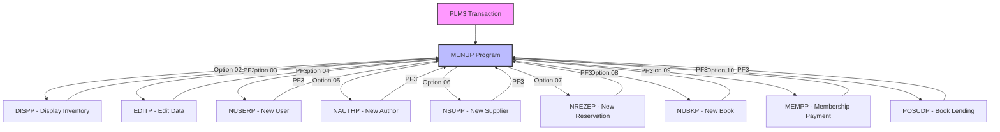

```mermaid
graph TD
    A[PLM3 Transaction] --> B[MENUP Program]
    B -->|Option 02| C[DISPP - Display Inventory]
    B -->|Option 03| D[EDITP - Edit Data]
    B -->|Option 04| E[NUSERP - New User]
    B -->|Option 05| F[NAUTHP - New Author]
    B -->|Option 06| G[NSUPP - New Supplier]
    B -->|Option 07| H[NREZEP - New Reservation]
    B -->|Option 08| I[NUBKP - New Book]
    B -->|Option 09| J[MEMPP - Membership Payment]
    B -->|Option 10| K[POSUDP - Book Lending]
    
    C -->|PF3| B
    D -->|PF3| B
    E -->|PF3| B
    F -->|PF3| B
    G -->|PF3| B
    H -->|PF3| B
    I -->|PF3| B
    J -->|PF3| B
    K -->|PF3| B

    style A fill:#f9f,stroke:#333,stroke-width:2px
    style B fill:#bbf,stroke:#333,stroke-width:2px
```